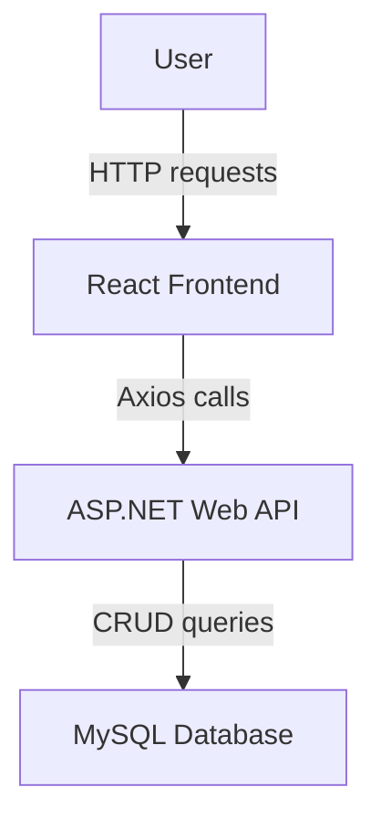

# Application Architecture

This repository contains a small user management system implemented with three main components:

1. **React front‑end (`frontend`)** – user interface for managing users.
2. **ASP.NET Web APIs** – two alternatives are provided:
   - `UserManagementApi` uses direct MySQL data access with `MySql.Data`.
   - `UserManagementApi_EntityFrmwk` uses Entity Framework Core.
3. **MySQL database** – stores user data. The schema is defined in `MySqlDBScripts/userdbscript.sql`.

The typical flow is shown in the diagram below.

## Detailed Flow

1. A user interacts with the React application in the browser. The components in `frontend/src/Components` send HTTP requests via Axios.
2. These requests go to the ASP.NET Web API project (`UserManagementApi` by default). Each controller action maps to a CRUD operation handled by `UsersDataAccess`.
3. The data access layer issues SQL commands to MySQL and returns the results to the controller.
4. The API responds with JSON data, which the React app uses to update the UI.

Both API projects expose the same routes (`/api/users`) so you can swap implementations without changing the frontend. The diagram illustrates the common request path from the user, through the frontend, into the API, and finally the database.
